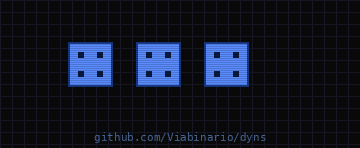

# DYN — Dynamo Scripts Repository

Colección de scripts de automatización para Revit 2024 usando Dynamo.

## Scripts disponibles

| Carpeta | Descripción |
|---------|------------|
| `Write_Project_Data` | Lee datos de un CSV y copia valores en los parámetros de información del proyecto de múltiples documentos Revit abiertos. |
| `Purge_Templates_Views` | Identifica y elimina plantillas de vistas no utilizadas. |
| `Purge_Filters_Views` | Identifica y elimina filtros de vistas no asignados. |
| `Mass_Analysis` | Genera volúmenes 3D (masas) a partir de rooms, incluyendo elementos de archivos vinculados. |

## Requisitos generales

- Autodesk Revit 2024
- Dynamo 2.x / 3.x (incluido en Revit)
- Python 3 (para scripts con nodos Python Script)
- Worksharing activado en algunos scripts (ver carpeta específica)

## Uso

Cada carpeta contiene su propio gráfico `.dyn` y README con instrucciones detalladas. Consultar la documentación específica de cada proyecto.

## Notas

- Realizar copia de seguridad de los documentos antes de ejecutar cualquier script que modifique el modelo.
- Los scripts están optimizados para Revit 2024 y pueden no ser compatibles con versiones anteriores.
